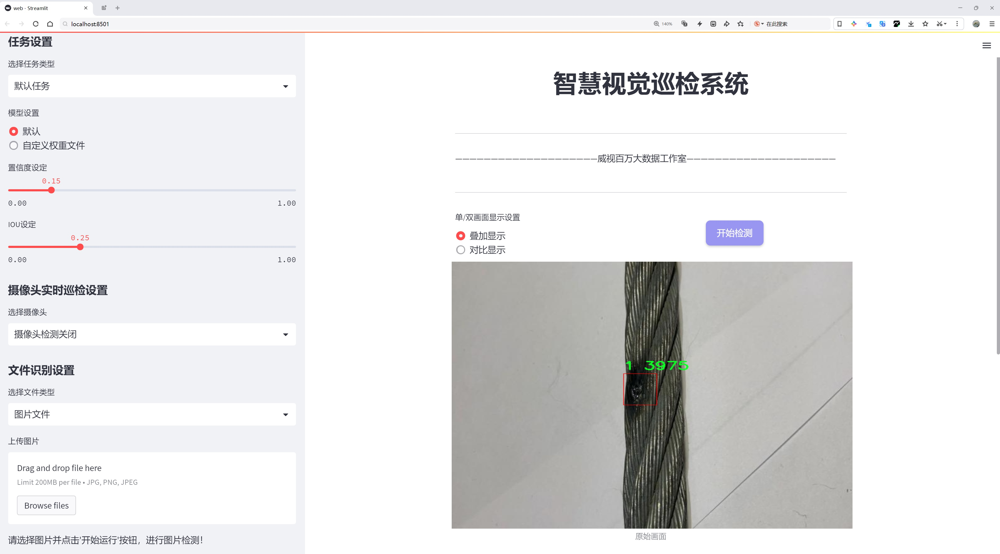
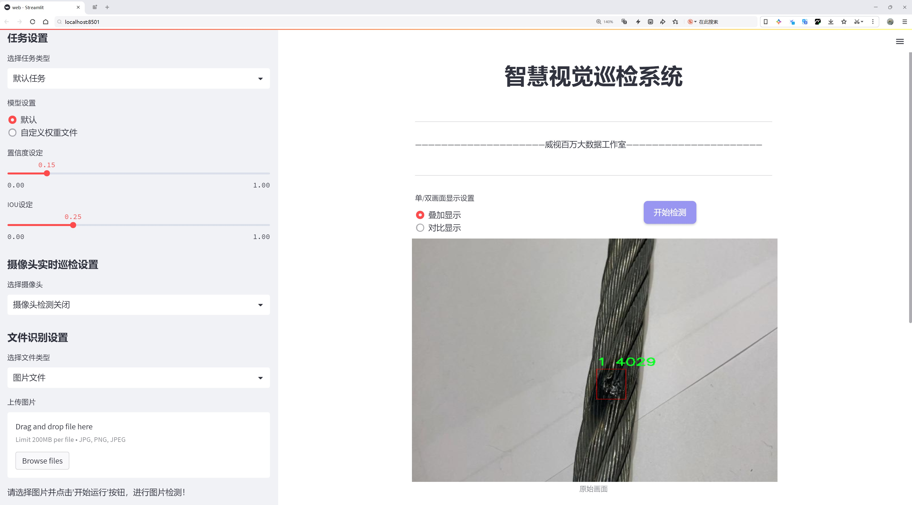
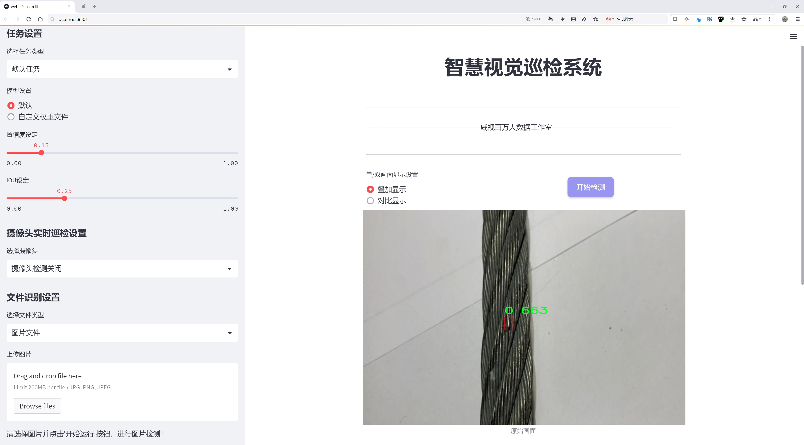
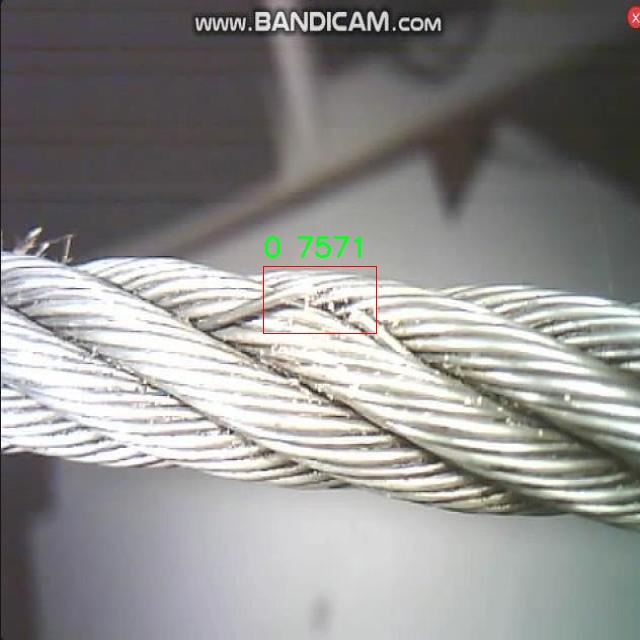
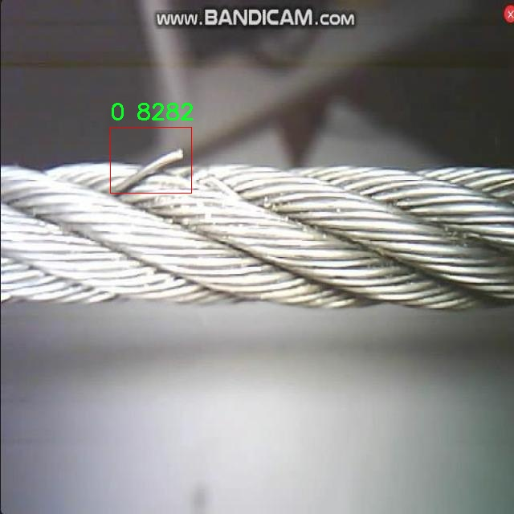
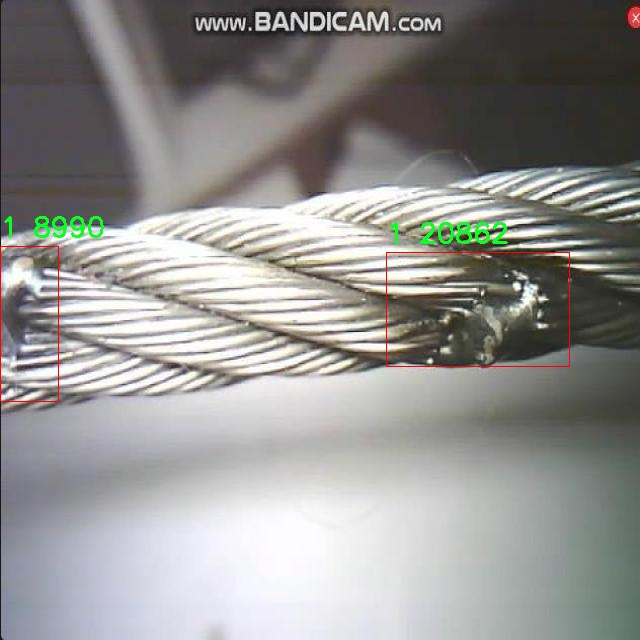
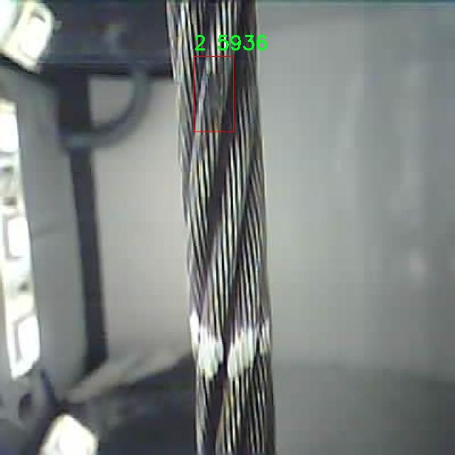
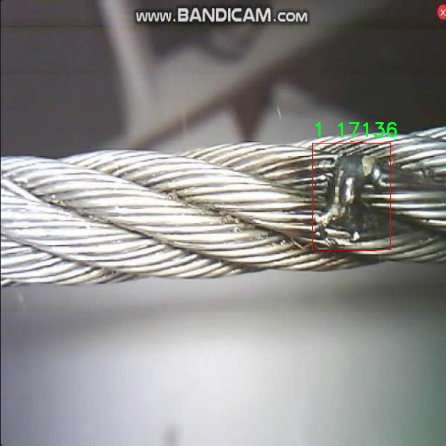

# 电缆缺陷检测检测系统源码分享
 # [一条龙教学YOLOV8标注好的数据集一键训练_70+全套改进创新点发刊_Web前端展示]

### 1.研究背景与意义

项目参考[AAAI Association for the Advancement of Artificial Intelligence](https://gitee.com/qunmasj/projects)

项目来源[AACV Association for the Advancement of Computer Vision](https://kdocs.cn/l/cszuIiCKVNis)

研究背景与意义

随着现代工业的迅速发展，电缆作为电力传输和通信的重要组成部分，其安全性和可靠性愈发受到重视。电缆在长期使用过程中，容易受到环境因素、机械损伤以及老化等多种因素的影响，导致出现各种缺陷。这些缺陷不仅可能造成电力供应中断，还可能引发火灾等严重安全事故。因此，及时、准确地检测电缆缺陷，对于保障电力系统的安全运行和维护设备的正常运转具有重要意义。

传统的电缆缺陷检测方法多依赖人工巡检和传统的检测仪器，这些方法不仅效率低下，而且容易受到人为因素的影响，导致漏检或误检的情况。随着计算机视觉和深度学习技术的迅猛发展，基于图像处理的自动化检测方法逐渐成为研究的热点。YOLO（You Only Look Once）系列模型因其高效的实时目标检测能力，广泛应用于各类物体检测任务中。YOLOv8作为该系列的最新版本，具备更强的特征提取能力和更快的推理速度，能够在复杂环境中实现高精度的目标检测。

本研究旨在基于改进的YOLOv8模型，构建一个高效的电缆缺陷检测系统。我们将利用包含1800张图像的“cable123”数据集，该数据集涵盖了三类电缆缺陷（类别0、1、2），为模型的训练和测试提供了丰富的样本。这一数据集的多样性和代表性将为电缆缺陷检测系统的性能提升奠定基础。通过对YOLOv8模型的改进，我们将针对电缆缺陷的特征进行优化，提升模型在小目标检测和复杂背景下的表现，从而提高检测的准确率和召回率。

本研究的意义不仅在于提升电缆缺陷检测的效率和准确性，更在于推动智能检测技术在电力行业的应用。通过实现自动化检测，能够有效降低人工成本，减少人为错误，提高电缆维护的及时性。此外，基于深度学习的检测系统还具备良好的扩展性，未来可以通过不断更新数据集和优化模型，适应更多种类的电缆缺陷检测需求。

综上所述，基于改进YOLOv8的电缆缺陷检测系统的研究，不仅为电力行业提供了一种新的检测手段，也为深度学习在工业检测领域的应用提供了实践案例。通过该研究，我们期望能够为电缆的安全运行提供有力保障，为电力系统的稳定性和可靠性贡献一份力量。

### 2.图片演示







##### 注意：由于此博客编辑较早，上面“2.图片演示”和“3.视频演示”展示的系统图片或者视频可能为老版本，新版本在老版本的基础上升级如下：（实际效果以升级的新版本为准）

  （1）适配了YOLOV8的“目标检测”模型和“实例分割”模型，通过加载相应的权重（.pt）文件即可自适应加载模型。

  （2）支持“图片识别”、“视频识别”、“摄像头实时识别”三种识别模式。

  （3）支持“图片识别”、“视频识别”、“摄像头实时识别”三种识别结果保存导出，解决手动导出（容易卡顿出现爆内存）存在的问题，识别完自动保存结果并导出到tempDir中。

  （4）支持Web前端系统中的标题、背景图等自定义修改，后面提供修改教程。

  另外本项目提供训练的数据集和训练教程,暂不提供权重文件（best.pt）,需要您按照教程进行训练后实现图片演示和Web前端界面演示的效果。

### 3.视频演示

[3.1 视频演示](https://www.bilibili.com/video/BV1LpxFeEExg/)

### 4.数据集信息展示

##### 4.1 本项目数据集详细数据（类别数＆类别名）

nc: 3
names: ['0', '1', '2']


##### 4.2 本项目数据集信息介绍

数据集信息展示

在现代工业生产中，电缆的质量与安全性至关重要，尤其是在电力、通信和交通等关键领域。为了提升电缆缺陷检测的效率与准确性，针对电缆缺陷的自动化检测系统的研究逐渐成为热点。在这一背景下，名为“cable123”的数据集应运而生，旨在为改进YOLOv8模型提供高质量的训练数据，以实现更为精准的电缆缺陷检测。

“cable123”数据集专注于电缆缺陷的多样性，包含三种主要类别，分别用数字“0”、“1”和“2”进行标识。这些类别的划分不仅反映了电缆缺陷的不同类型，还为模型的训练提供了丰富的样本，使其能够在多种情况下进行有效的检测。具体而言，类别“0”可能代表电缆的轻微损伤，如表面划痕或小裂纹；类别“1”则可能对应于中等程度的缺陷，例如电缆绝缘层的局部破损；而类别“2”则代表严重缺陷，可能包括电缆的断裂或大面积的绝缘层剥离。这种分类方式不仅有助于模型在检测时进行准确的判断，还能够为后续的缺陷处理提供依据。

数据集的构建过程中，采用了多种数据采集技术，以确保样本的多样性和代表性。通过高分辨率的图像采集设备，数据集中的每一张图像都经过精心标注，确保缺陷的类型、位置和严重程度都能被准确识别。这种细致的标注工作不仅提高了数据集的质量，也为模型的训练提供了坚实的基础。数据集中的图像覆盖了不同的电缆类型、环境条件和光照变化，旨在模拟实际应用中可能遇到的各种情况，从而增强模型的鲁棒性。

在训练过程中，YOLOv8模型将利用“cable123”数据集中的标注信息进行学习，识别不同类别的电缆缺陷。通过深度学习算法，模型将不断优化其特征提取能力，以提高对电缆缺陷的检测精度。数据集的设计理念不仅关注于缺陷的识别，还强调了对缺陷严重程度的评估，使得模型在实际应用中能够根据缺陷的不同程度采取相应的处理措施。

总之，“cable123”数据集为电缆缺陷检测系统的研究提供了重要的支持。通过对电缆缺陷的深入分析与分类，该数据集不仅为YOLOv8模型的训练奠定了基础，也为未来电缆检测技术的发展指明了方向。随着深度学习技术的不断进步，借助这一数据集，电缆缺陷检测系统有望实现更高的自动化水平和更强的适应能力，为工业安全与效率的提升贡献力量。











### 5.全套项目环境部署视频教程（零基础手把手教学）

[5.1 环境部署教程链接（零基础手把手教学）](https://www.ixigua.com/7404473917358506534?logTag=c807d0cbc21c0ef59de5)


[5.2 安装Python虚拟环境创建和依赖库安装视频教程链接（零基础手把手教学）](https://www.ixigua.com/7404474678003106304?logTag=1f1041108cd1f708b01a)

### 6.手把手YOLOV8训练视频教程（零基础小白有手就能学会）

[6.1 手把手YOLOV8训练视频教程（零基础小白有手就能学会）](https://www.ixigua.com/7404477157818401292?logTag=d31a2dfd1983c9668658)

### 7.70+种全套YOLOV8创新点代码加载调参视频教程（一键加载写好的改进模型的配置文件）

[7.1 70+种全套YOLOV8创新点代码加载调参视频教程（一键加载写好的改进模型的配置文件）](https://www.ixigua.com/7404478314661806627?logTag=29066f8288e3f4eea3a4)

### 8.70+种全套YOLOV8创新点原理讲解（非科班也可以轻松写刊发刊，V10版本正在科研待更新）

由于篇幅限制，每个创新点的具体原理讲解就不一一展开，具体见下列网址中的创新点对应子项目的技术原理博客网址【Blog】：


[8.1 70+种全套YOLOV8创新点原理讲解链接](https://gitee.com/qunmasj/good)

### 9.系统功能展示（检测对象为举例，实际内容以本项目数据集为准）

图9.1.系统支持检测结果表格显示

  图9.2.系统支持置信度和IOU阈值手动调节

  图9.3.系统支持自定义加载权重文件best.pt(需要你通过步骤5中训练获得)

  图9.4.系统支持摄像头实时识别

  图9.5.系统支持图片识别

  图9.6.系统支持视频识别

  图9.7.系统支持识别结果文件自动保存

  图9.8.系统支持Excel导出检测结果数据


### 10.原始YOLOV8算法原理

原始YOLOv8算法原理

YOLOv8是Ultralytics公司在2023年推出的最新目标检测算法，它在前几代YOLO模型的基础上进行了重要的改进和创新，旨在提高目标检测的速度和精度。YOLOv8的设计理念围绕着快速、准确和易于使用的原则，使其成为广泛应用于目标检测、图像分割和图像分类任务的理想选择。其网络结构主要由输入层、主干网络、特征融合层和解耦头组成，构成了一个高效的端到端目标检测框架。

在输入层，YOLOv8采用了640x640的默认图像尺寸，然而在实际应用中，图像的长宽比往往不一致。为了解决这一问题，YOLOv8引入了自适应图片缩放技术。在模型推理阶段，长边会被按比例缩小到指定尺寸，而短边则会进行填充，这种方法有效减少了填充所带来的信息冗余，提高了目标检测的速度和准确性。此外，在训练过程中，YOLOv8使用了Mosaic图像增强技术，该技术通过随机选取四张图像进行缩放和拼接，生成新的训练样本，从而使模型能够学习到不同位置和周围像素的特征，进一步提升了模型的预测精度。

YOLOv8的主干网络部分进行了显著的改进，特别是在模块设计上。它借鉴了YOLOv7中的ELAN模块思想，将YOLOv5中的C3模块替换为C2F模块。C2F模块通过并行更多的梯度流分支，增强了特征提取的能力，确保在保持轻量化的同时提高了检测精度和响应速度。与传统的C3模块相比，C2F模块在设计上更为灵活，能够更好地适应不同规模的模型需求，提供更加丰富的梯度流信息。

在特征融合层，YOLOv8采用了PAN-FPN结构，这一结构的设计旨在增强多尺度特征之间的融合能力。YOLOv8在此阶段去除了YOLOv5中多余的卷积连接层，直接将主干网络输出的特征进行上采样处理，确保了不同层次特征的有效融合。通过自下而上的特征融合，YOLOv8能够充分利用浅层特征的细节信息和高层特征的语义信息，从而提高目标检测的准确性。

YOLOv8的检测头部分是其创新的关键所在，采用了解耦头的设计。与YOLOv5的耦合头不同，YOLOv8将分类和回归任务分为两个独立的分支，使得每个任务能够更加专注于自身的目标。这种解耦设计有效解决了复杂场景下定位不准确和分类错误的问题。YOLOv8还引入了Anchor-Free的方法，抛弃了传统的Anchor-Based思想，直接将目标检测转化为关键点检测。这一创新使得YOLOv8在处理不同尺度和形状的目标时更加灵活，简化了模型的设计，同时提高了其泛化能力。

在损失函数的设计上，YOLOv8使用了分布焦点损失（DFL）和CIoU损失，旨在加速模型对标签附近数值的聚焦。通过优化损失函数，YOLOv8能够更有效地处理样本不平衡问题，尤其是在面对小目标时，Focal Loss的引入使得模型在训练过程中能够更好地关注难以分类的样本，提升了整体检测精度。

总的来说，YOLOv8通过一系列创新和改进，提升了目标检测的性能和灵活性。其在网络结构上的优化、特征融合的增强以及解耦头的引入，使得YOLOv8在实际应用中能够更快速、更准确地完成目标检测任务。随着YOLOv8的推出，目标检测领域又迈入了一个新的阶段，未来的研究和应用将更加广泛，推动着计算机视觉技术的不断进步。


### 11.项目核心源码讲解（再也不用担心看不懂代码逻辑）

#### 11.1 70+种YOLOv8算法改进源码大全和调试加载训练教程（非必要）\ultralytics\models\yolo\segment\predict.py

以下是经过精简和注释的核心代码部分：

```python
# 引入必要的模块和类
from ultralytics.engine.results import Results
from ultralytics.models.yolo.detect.predict import DetectionPredictor
from ultralytics.utils import DEFAULT_CFG, ops

class SegmentationPredictor(DetectionPredictor):
    """
    SegmentationPredictor类扩展了DetectionPredictor类，用于基于分割模型的预测。
    """

    def __init__(self, cfg=DEFAULT_CFG, overrides=None, _callbacks=None):
        """初始化SegmentationPredictor，设置配置、覆盖参数和回调函数。"""
        super().__init__(cfg, overrides, _callbacks)  # 调用父类构造函数
        self.args.task = 'segment'  # 设置任务类型为分割

    def postprocess(self, preds, img, orig_imgs):
        """对每个输入图像的预测结果进行后处理，包括非极大值抑制和掩膜处理。"""
        # 应用非极大值抑制，过滤掉低置信度的检测框
        p = ops.non_max_suppression(preds[0],
                                     self.args.conf,
                                     self.args.iou,
                                     agnostic=self.args.agnostic_nms,
                                     max_det=self.args.max_det,
                                     nc=len(self.model.names),
                                     classes=self.args.classes)

        # 如果输入图像不是列表，则将其转换为numpy数组
        if not isinstance(orig_imgs, list):
            orig_imgs = ops.convert_torch2numpy_batch(orig_imgs)

        results = []  # 存储结果的列表
        proto = preds[1][-1] if len(preds[1]) == 3 else preds[1]  # 获取掩膜原型

        # 遍历每个预测结果
        for i, pred in enumerate(p):
            orig_img = orig_imgs[i]  # 获取原始图像
            img_path = self.batch[0][i]  # 获取图像路径

            if not len(pred):  # 如果没有检测到物体
                masks = None  # 掩膜设置为None
            elif self.args.retina_masks:  # 如果使用Retina掩膜
                # 缩放检测框到原始图像大小
                pred[:, :4] = ops.scale_boxes(img.shape[2:], pred[:, :4], orig_img.shape)
                # 处理掩膜
                masks = ops.process_mask_native(proto[i], pred[:, 6:], pred[:, :4], orig_img.shape[:2])  # HWC
            else:  # 否则使用常规掩膜处理
                masks = ops.process_mask(proto[i], pred[:, 6:], pred[:, :4], img.shape[2:], upsample=True)  # HWC
                # 缩放检测框到原始图像大小
                pred[:, :4] = ops.scale_boxes(img.shape[2:], pred[:, :4], orig_img.shape)

            # 将结果添加到结果列表中
            results.append(Results(orig_img, path=img_path, names=self.model.names, boxes=pred[:, :6], masks=masks))

        return results  # 返回处理后的结果
```

### 代码分析
1. **类的定义**：`SegmentationPredictor`类继承自`DetectionPredictor`，用于实现基于分割模型的预测功能。
2. **初始化方法**：在构造函数中，调用父类的构造函数，并设置任务类型为分割。
3. **后处理方法**：`postprocess`方法负责对模型的预测结果进行后处理，包括：
   - 应用非极大值抑制（NMS）来过滤掉低置信度的检测框。
   - 将输入图像转换为numpy数组（如果不是列表）。
   - 遍历每个预测结果，处理掩膜并缩放检测框到原始图像的大小。
   - 最后将结果存储在`Results`对象中并返回。 

该代码实现了YOLO模型的分割预测功能，并通过后处理步骤提高了预测结果的准确性。

该文件是一个用于YOLOv8模型的分割预测的Python代码，主要实现了基于分割模型的预测功能。代码中定义了一个名为`SegmentationPredictor`的类，它继承自`DetectionPredictor`类，专门用于处理图像分割任务。

在类的构造函数`__init__`中，调用了父类的构造函数，并设置了任务类型为“segment”，这表明该预测器将用于图像分割。构造函数接收三个参数：配置`cfg`，覆盖参数`overrides`，以及回调函数`_callbacks`，其中`cfg`的默认值为`DEFAULT_CFG`。

`postprocess`方法是该类的核心功能之一，它用于对模型的预测结果进行后处理。该方法接收三个参数：`preds`（模型的预测结果），`img`（输入图像），以及`orig_imgs`（原始图像）。在方法内部，首先调用`ops.non_max_suppression`函数对预测结果进行非极大值抑制，以减少冗余的检测框。该函数的参数包括置信度阈值、IOU阈值、是否使用无关类别的NMS、最大检测框数量、类别数量和特定类别等。

接下来，代码检查输入的原始图像是否为列表，如果不是，则将其转换为NumPy数组。然后，代码提取模型的第二个输出，通常是分割掩码的原型。接着，对于每一个预测结果，代码进行处理：如果没有检测到任何物体，则掩码设置为`None`；如果启用了`retina_masks`，则调用`ops.process_mask_native`函数处理掩码；否则，调用`ops.process_mask`函数处理掩码，并进行必要的上采样。

最后，代码将处理后的结果封装成`Results`对象，并将其添加到结果列表中。每个`Results`对象包含了原始图像、图像路径、类别名称、检测框和掩码等信息。最终，`postprocess`方法返回所有处理后的结果。

整体来看，该文件实现了YOLOv8分割模型的预测功能，能够对输入图像进行分割，并返回相应的结果，适用于图像分割任务的开发和应用。

#### 11.2 ui.py

以下是经过简化和注释的核心代码部分：

```python
import sys
import subprocess

def run_script(script_path):
    """
    使用当前 Python 环境运行指定的脚本。

    Args:
        script_path (str): 要运行的脚本路径

    Returns:
        None
    """
    # 获取当前 Python 解释器的路径
    python_path = sys.executable

    # 构建运行命令，使用 streamlit 运行指定的脚本
    command = f'"{python_path}" -m streamlit run "{script_path}"'

    # 执行命令并等待其完成
    result = subprocess.run(command, shell=True)
    
    # 检查命令执行结果，如果返回码不为0，则表示出错
    if result.returncode != 0:
        print("脚本运行出错。")

# 主程序入口
if __name__ == "__main__":
    # 指定要运行的脚本路径
    script_path = "web.py"  # 这里可以直接指定脚本名

    # 调用函数运行脚本
    run_script(script_path)
```

### 代码注释说明：
1. **导入模块**：
   - `sys`：用于获取当前 Python 解释器的路径。
   - `subprocess`：用于执行外部命令。

2. **`run_script` 函数**：
   - 定义了一个函数，接受一个参数 `script_path`，表示要运行的脚本路径。
   - 使用 `sys.executable` 获取当前 Python 解释器的路径，以便在正确的环境中运行脚本。
   - 构建一个命令字符串，使用 `streamlit` 运行指定的脚本。
   - 使用 `subprocess.run` 执行命令，并等待其完成。
   - 检查命令的返回码，如果不为0，表示脚本运行出错，打印错误信息。

3. **主程序入口**：
   - 使用 `if __name__ == "__main__":` 确保只有在直接运行该脚本时才会执行以下代码。
   - 指定要运行的脚本路径（在这里直接使用了 `"web.py"`）。
   - 调用 `run_script` 函数来执行指定的脚本。

这个程序文件名为 `ui.py`，主要功能是使用当前的 Python 环境来运行一个指定的脚本，具体是通过 Streamlit 框架来启动一个 Web 应用。

首先，程序导入了几个必要的模块，包括 `sys`、`os` 和 `subprocess`。其中，`sys` 模块用于访问与 Python 解释器相关的变量和函数，`os` 模块提供了与操作系统交互的功能，而 `subprocess` 模块则用于执行外部命令。

接下来，程序从 `QtFusion.path` 模块中导入了 `abs_path` 函数，这个函数的作用是获取给定路径的绝对路径。

在 `run_script` 函数中，首先定义了一个参数 `script_path`，它表示要运行的脚本的路径。函数内部首先获取当前 Python 解释器的路径，并将其存储在 `python_path` 变量中。然后，构建了一个命令字符串 `command`，这个命令使用当前的 Python 解释器和 Streamlit 模块来运行指定的脚本。

使用 `subprocess.run` 方法执行这个命令，并通过 `shell=True` 参数在一个新的 shell 中运行命令。执行完命令后，程序检查返回的结果，如果返回码不为 0，表示脚本运行出错，程序会打印出相应的错误信息。

在文件的最后部分，使用 `if __name__ == "__main__":` 语句来确保只有在直接运行该脚本时才会执行下面的代码。在这里，指定了要运行的脚本路径 `script_path`，通过调用 `abs_path` 函数获取 `web.py` 的绝对路径。最后，调用 `run_script` 函数来运行这个脚本。

总的来说，这个程序的核心功能是封装了一个简单的接口，通过命令行启动一个 Streamlit 应用，便于用户在本地环境中快速运行和测试 Web 应用。

#### 11.3 code\ultralytics\utils\callbacks\wb.py

以下是代码中最核心的部分，并附上详细的中文注释：

```python
# 导入必要的库
from ultralytics.utils import SETTINGS, TESTS_RUNNING
from ultralytics.utils.torch_utils import model_info_for_loggers

try:
    # 确保当前不是在运行测试
    assert not TESTS_RUNNING  
    # 确保WandB集成已启用
    assert SETTINGS["wandb"] is True  
    import wandb as wb  # 导入WandB库

    # 确保WandB库的版本有效
    assert hasattr(wb, "__version__")  

    import numpy as np  # 导入NumPy库
    import pandas as pd  # 导入Pandas库

    _processed_plots = {}  # 用于存储已处理的图表

except (ImportError, AssertionError):
    wb = None  # 如果导入失败，设置wb为None


def _custom_table(x, y, classes, title="Precision Recall Curve", x_title="Recall", y_title="Precision"):
    """
    创建并记录自定义的精确度-召回率曲线可视化。

    Args:
        x (List): x轴的值，长度为N。
        y (List): y轴的值，长度为N。
        classes (List): 每个点的类别标签，长度为N。
        title (str, optional): 图表标题，默认为'Precision Recall Curve'。
        x_title (str, optional): x轴标签，默认为'Recall'。
        y_title (str, optional): y轴标签，默认为'Precision'。

    Returns:
        (wandb.Object): 适合记录的WandB对象，展示自定义的可视化指标。
    """
    # 创建数据框
    df = pd.DataFrame({"class": classes, "y": y, "x": x}).round(3)
    fields = {"x": "x", "y": "y", "class": "class"}
    string_fields = {"title": title, "x-axis-title": x_title, "y-axis-title": y_title}
    
    # 使用WandB记录表格
    return wb.plot_table(
        "wandb/area-under-curve/v0", wb.Table(dataframe=df), fields=fields, string_fields=string_fields
    )


def _plot_curve(
    x,
    y,
    names=None,
    id="precision-recall",
    title="Precision Recall Curve",
    x_title="Recall",
    y_title="Precision",
    num_x=100,
    only_mean=False,
):
    """
    记录指标曲线可视化。

    Args:
        x (np.ndarray): x轴数据点，长度为N。
        y (np.ndarray): y轴对应数据点，形状为CxN，C为类别数。
        names (list, optional): y轴数据对应的类别名称，长度为C。
        id (str, optional): 在WandB中记录数据的唯一标识符，默认为'precision-recall'。
        title (str, optional): 可视化图表的标题，默认为'Precision Recall Curve'。
        x_title (str, optional): x轴的标签，默认为'Recall'。
        y_title (str, optional): y轴的标签，默认为'Precision'。
        num_x (int, optional): 可视化的插值数据点数量，默认为100。
        only_mean (bool, optional): 指示是否仅绘制均值曲线的标志，默认为False。

    Note:
        该函数利用'_custom_table'函数生成实际的可视化。
    """
    # 创建新的x轴数据
    if names is None:
        names = []
    x_new = np.linspace(x[0], x[-1], num_x).round(5)

    # 创建用于记录的数组
    x_log = x_new.tolist()
    y_log = np.interp(x_new, x, np.mean(y, axis=0)).round(3).tolist()

    if only_mean:
        # 仅记录均值曲线
        table = wb.Table(data=list(zip(x_log, y_log)), columns=[x_title, y_title])
        wb.run.log({title: wb.plot.line(table, x_title, y_title, title=title)})
    else:
        # 记录每个类别的曲线
        classes = ["mean"] * len(x_log)
        for i, yi in enumerate(y):
            x_log.extend(x_new)  # 添加新的x数据
            y_log.extend(np.interp(x_new, x, yi))  # 对y进行插值
            classes.extend([names[i]] * len(x_new))  # 添加类别名称
        wb.log({id: _custom_table(x_log, y_log, classes, title, x_title, y_title)}, commit=False)


def on_fit_epoch_end(trainer):
    """在每个训练周期结束时记录训练指标和模型信息。"""
    wb.run.log(trainer.metrics, step=trainer.epoch + 1)  # 记录训练指标
    # 记录图表
    _log_plots(trainer.plots, step=trainer.epoch + 1)
    _log_plots(trainer.validator.plots, step=trainer.epoch + 1)
    if trainer.epoch == 0:
        wb.run.log(model_info_for_loggers(trainer), step=trainer.epoch + 1)  # 记录模型信息


def on_train_end(trainer):
    """在训练结束时保存最佳模型作为artifact。"""
    _log_plots(trainer.validator.plots, step=trainer.epoch + 1)  # 记录验证器图表
    _log_plots(trainer.plots, step=trainer.epoch + 1)  # 记录训练图表
    art = wb.Artifact(type="model", name=f"run_{wb.run.id}_model")  # 创建模型artifact
    if trainer.best.exists():
        art.add_file(trainer.best)  # 添加最佳模型文件
        wb.run.log_artifact(art, aliases=["best"])  # 记录artifact
    wb.run.finish()  # 结束WandB运行
```

### 代码核心部分解释：
1. **WandB集成**：代码首先检查WandB库是否可用，并确保在非测试环境中运行。
2. **自定义表格函数**：`_custom_table`函数用于创建和记录精确度-召回率曲线的可视化，使用Pandas数据框架存储数据。
3. **绘制曲线函数**：`_plot_curve`函数生成并记录曲线的可视化，支持绘制均值曲线或每个类别的曲线。
4. **训练结束回调**：`on_fit_epoch_end`和`on_train_end`函数在训练结束时记录指标和模型信息，并保存最佳模型。

以上部分是代码的核心逻辑，负责记录模型训练过程中的各种指标和可视化结果。

这个程序文件是用于与WandB（Weights and Biases）集成的回调函数，主要用于在训练YOLO模型时记录和可视化训练过程中的各种指标和图表。文件的开头导入了一些必要的库和模块，包括Ultralytics的工具和WandB库。通过断言确保在测试运行时不记录日志，并验证WandB集成是否启用。

在尝试导入WandB时，如果出现导入错误或断言错误，则将WandB设置为None，以防止后续代码出现问题。接下来定义了一些函数。

首先是`_custom_table`函数，它用于创建并记录一个自定义的精确度-召回曲线的可视化图表。该函数接受x轴和y轴的数据，以及类别标签，并生成一个数据框，然后使用WandB的`plot_table`方法将其记录。

接着是`_plot_curve`函数，该函数用于生成并记录一个指标曲线的可视化。它根据输入的数据生成曲线，并可以选择只记录平均曲线或所有类别的曲线。该函数会调用`_custom_table`来生成实际的可视化。

然后是`_log_plots`函数，它用于记录输入字典中的图表，如果这些图表在指定的步骤中尚未记录过。它通过检查时间戳来确保每个图表只记录一次。

接下来是几个回调函数：`on_pretrain_routine_start`、`on_fit_epoch_end`、`on_train_epoch_end`和`on_train_end`。这些函数在训练的不同阶段被调用，分别用于初始化WandB项目、记录训练指标、记录训练损失和学习率，以及在训练结束时保存最佳模型并记录最终的图表和曲线。

最后，定义了一个`callbacks`字典，如果WandB可用，则将上述回调函数添加到字典中，以便在训练过程中使用。

整体来看，这个文件的主要功能是集成WandB以便于监控和记录YOLO模型的训练过程，提供了多种可视化手段来帮助开发者分析模型性能。

#### 11.4 train.py

以下是经过简化和注释的核心代码部分：

```python
import random
import numpy as np
import torch.nn as nn
from ultralytics.data import build_dataloader, build_yolo_dataset
from ultralytics.engine.trainer import BaseTrainer
from ultralytics.models import yolo
from ultralytics.nn.tasks import DetectionModel
from ultralytics.utils import LOGGER, RANK
from ultralytics.utils.torch_utils import de_parallel, torch_distributed_zero_first

class DetectionTrainer(BaseTrainer):
    """
    基于检测模型的训练类，继承自BaseTrainer类。
    """

    def build_dataset(self, img_path, mode="train", batch=None):
        """
        构建YOLO数据集。

        参数:
            img_path (str): 包含图像的文件夹路径。
            mode (str): 模式，`train`或`val`，可以为每种模式自定义不同的数据增强。
            batch (int, optional): 批次大小，适用于`rect`模式。默认为None。
        """
        gs = max(int(de_parallel(self.model).stride.max() if self.model else 0), 32)
        return build_yolo_dataset(self.args, img_path, batch, self.data, mode=mode, rect=mode == "val", stride=gs)

    def get_dataloader(self, dataset_path, batch_size=16, rank=0, mode="train"):
        """构造并返回数据加载器。"""
        assert mode in ["train", "val"]
        with torch_distributed_zero_first(rank):  # 在分布式环境中仅初始化一次数据集
            dataset = self.build_dataset(dataset_path, mode, batch_size)
        shuffle = mode == "train"  # 训练模式下打乱数据
        workers = self.args.workers if mode == "train" else self.args.workers * 2
        return build_dataloader(dataset, batch_size, workers, shuffle, rank)  # 返回数据加载器

    def preprocess_batch(self, batch):
        """对图像批次进行预处理，包括缩放和转换为浮点数。"""
        batch["img"] = batch["img"].to(self.device, non_blocking=True).float() / 255  # 将图像转换为浮点数并归一化
        if self.args.multi_scale:  # 如果启用多尺度
            imgs = batch["img"]
            sz = (
                random.randrange(self.args.imgsz * 0.5, self.args.imgsz * 1.5 + self.stride)
                // self.stride
                * self.stride
            )  # 随机选择尺寸
            sf = sz / max(imgs.shape[2:])  # 计算缩放因子
            if sf != 1:
                ns = [
                    math.ceil(x * sf / self.stride) * self.stride for x in imgs.shape[2:]
                ]  # 计算新的形状
                imgs = nn.functional.interpolate(imgs, size=ns, mode="bilinear", align_corners=False)  # 进行插值缩放
            batch["img"] = imgs
        return batch

    def set_model_attributes(self):
        """设置模型的属性，包括类别数量和名称。"""
        self.model.nc = self.data["nc"]  # 将类别数量附加到模型
        self.model.names = self.data["names"]  # 将类别名称附加到模型
        self.model.args = self.args  # 将超参数附加到模型

    def get_model(self, cfg=None, weights=None, verbose=True):
        """返回YOLO检测模型。"""
        model = DetectionModel(cfg, nc=self.data["nc"], verbose=verbose and RANK == -1)
        if weights:
            model.load(weights)  # 加载权重
        return model

    def plot_training_samples(self, batch, ni):
        """绘制带有注释的训练样本。"""
        plot_images(
            images=batch["img"],
            batch_idx=batch["batch_idx"],
            cls=batch["cls"].squeeze(-1),
            bboxes=batch["bboxes"],
            paths=batch["im_file"],
            fname=self.save_dir / f"train_batch{ni}.jpg",
            on_plot=self.on_plot,
        )
```

### 代码说明：
1. **导入必要的库**：引入了PyTorch和Ultralytics库中的必要模块。
2. **DetectionTrainer类**：继承自`BaseTrainer`，用于训练YOLO检测模型。
3. **build_dataset方法**：根据给定的图像路径和模式构建YOLO数据集，支持训练和验证模式。
4. **get_dataloader方法**：构造数据加载器，支持分布式训练。
5. **preprocess_batch方法**：对输入的图像批次进行预处理，包括归一化和可选的多尺度调整。
6. **set_model_attributes方法**：设置模型的类别数量和名称等属性。
7. **get_model方法**：返回YOLO检测模型，并可选择加载预训练权重。
8. **plot_training_samples方法**：绘制训练样本及其对应的注释，用于可视化训练过程。

这个程序文件 `train.py` 是一个用于训练 YOLO（You Only Look Once）目标检测模型的脚本，继承自 `BaseTrainer` 类。它主要包含了数据集构建、数据加载、模型设置、训练过程中的损失计算、进度显示和结果可视化等功能。

首先，程序导入了必要的库和模块，包括数学运算、随机数生成、深度学习框架 PyTorch 相关的模块，以及 Ultralytics 提供的工具和模型定义。这些导入的模块为后续的模型训练提供了基础。

在 `DetectionTrainer` 类中，定义了多个方法来实现训练过程中的各个步骤。`build_dataset` 方法用于构建 YOLO 数据集，接收图像路径、模式（训练或验证）和批量大小作为参数。该方法通过调用 `build_yolo_dataset` 函数来生成数据集，并根据模型的步幅（stride）来调整图像的尺寸。

`get_dataloader` 方法用于构建数据加载器，确保在分布式训练中只初始化一次数据集。它会根据训练或验证模式设置是否打乱数据，并返回构建好的数据加载器。

`preprocess_batch` 方法负责对每个批次的图像进行预处理，包括将图像缩放到适当的大小并转换为浮点数。该方法还支持多尺度训练，通过随机选择图像大小来增强模型的鲁棒性。

`set_model_attributes` 方法用于设置模型的属性，包括类别数量和类别名称，以便模型能够正确识别不同的目标。

`get_model` 方法返回一个 YOLO 检测模型，并可选择加载预训练权重。`get_validator` 方法则返回一个用于模型验证的 `DetectionValidator` 实例，以便在训练过程中评估模型的性能。

`label_loss_items` 方法用于返回带有标签的训练损失项的字典，这对于目标检测任务是必要的。`progress_string` 方法返回一个格式化的字符串，显示训练进度，包括当前的 epoch、GPU 内存使用情况、损失值、实例数量和图像大小。

`plot_training_samples` 方法用于绘制训练样本及其标注，帮助可视化训练过程中的数据。最后，`plot_metrics` 和 `plot_training_labels` 方法分别用于绘制训练过程中的指标和标签，便于分析模型的训练效果。

总体而言，这个程序文件提供了一个完整的框架，用于训练 YOLO 模型，涵盖了数据处理、模型训练、损失计算和结果可视化等多个方面，便于用户进行目标检测任务的研究和应用。

#### 11.5 70+种YOLOv8算法改进源码大全和调试加载训练教程（非必要）\ultralytics\models\sam\modules\sam.py

以下是代码中最核心的部分，并附上详细的中文注释：

```python
import torch
from torch import nn

class Sam(nn.Module):
    """
    Sam (Segment Anything Model) 是一个用于对象分割任务的模型。它使用图像编码器生成图像嵌入，并使用提示编码器对各种类型的输入提示进行编码。然后，这些嵌入被掩码解码器用于预测对象掩码。
    """

    def __init__(
        self,
        image_encoder: ImageEncoderViT,  # 图像编码器，用于将图像编码为嵌入
        prompt_encoder: PromptEncoder,    # 提示编码器，用于编码输入提示
        mask_decoder: MaskDecoder,        # 掩码解码器，用于从图像嵌入和编码的提示中预测掩码
        pixel_mean: List[float] = (123.675, 116.28, 103.53),  # 输入图像的均值，用于归一化
        pixel_std: List[float] = (58.395, 57.12, 57.375)       # 输入图像的标准差，用于归一化
    ) -> None:
        """
        初始化 Sam 类，用于从图像和输入提示中预测对象掩码。

        参数:
            image_encoder (ImageEncoderViT): 用于将图像编码为图像嵌入的主干网络。
            prompt_encoder (PromptEncoder): 编码各种类型的输入提示。
            mask_decoder (MaskDecoder): 从图像嵌入和编码的提示中预测掩码。
            pixel_mean (List[float], optional): 用于归一化输入图像的均值，默认为 (123.675, 116.28, 103.53)。
            pixel_std (List[float], optional): 用于归一化输入图像的标准差，默认为 (58.395, 57.12, 57.375)。
        """
        super().__init__()  # 调用父类 nn.Module 的初始化方法
        self.image_encoder = image_encoder  # 保存图像编码器
        self.prompt_encoder = prompt_encoder  # 保存提示编码器
        self.mask_decoder = mask_decoder  # 保存掩码解码器
        # 注册均值和标准差为缓冲区，以便在模型中使用
        self.register_buffer('pixel_mean', torch.Tensor(pixel_mean).view(-1, 1, 1), False)
        self.register_buffer('pixel_std', torch.Tensor(pixel_std).view(-1, 1, 1), False)
```

### 代码说明：
1. **导入必要的库**：引入 `torch` 和 `torch.nn`，用于构建神经网络模型。
2. **定义 `Sam` 类**：该类继承自 `nn.Module`，用于实现分割模型。
3. **构造函数 `__init__`**：
   - 接收图像编码器、提示编码器和掩码解码器作为参数，并将它们存储为类的属性。
   - 设定图像的均值和标准差，用于图像的归一化处理，确保输入数据的分布一致。
   - 使用 `register_buffer` 方法将均值和标准差注册为模型的缓冲区，以便在模型训练和推理时使用，但不作为模型参数进行优化。

该程序文件是一个实现了“Segment Anything Model”（SAM）的PyTorch模块，主要用于对象分割任务。代码中定义了一个名为`Sam`的类，继承自`nn.Module`，这是PyTorch中所有神经网络模块的基类。

在类的文档字符串中，简要介绍了SAM的功能和结构。该模型使用图像编码器生成图像嵌入，并利用提示编码器对不同类型的输入提示进行编码。这些嵌入随后被掩码解码器用于预测对象的掩码。

类中定义了几个重要的属性，包括掩码预测的阈值`mask_threshold`和输入图像的格式`image_format`，默认设置为'RGB'。此外，类还包含三个主要组件：`image_encoder`（图像编码器），`prompt_encoder`（提示编码器）和`mask_decoder`（掩码解码器），它们分别负责图像嵌入的生成、输入提示的编码以及掩码的预测。为了进行图像归一化，类中还定义了`pixel_mean`和`pixel_std`属性，分别表示像素的均值和标准差。

在构造函数`__init__`中，初始化了上述属性。构造函数接受三个必需的参数：`image_encoder`、`prompt_encoder`和`mask_decoder`，以及两个可选参数`pixel_mean`和`pixel_std`，用于归一化输入图像的像素值。构造函数调用了父类的初始化方法，并使用`register_buffer`方法将均值和标准差注册为缓冲区，以便在模型训练和推理过程中保持这些值的状态。

总的来说，这段代码为对象分割任务提供了一个基础框架，利用图像和提示信息生成对象掩码，适用于各种计算机视觉应用。

#### 11.6 code\ultralytics\models\rtdetr\model.py

```python
# Ultralytics YOLO 🚀, AGPL-3.0 license
"""
RT-DETR模型接口，基于视觉变换器的实时目标检测器。RT-DETR提供实时性能和高准确性，
在CUDA和TensorRT等加速后端表现优异。它具有高效的混合编码器和IoU感知查询选择，
以提高检测准确性。
"""

from ultralytics.engine.model import Model  # 导入基础模型类
from ultralytics.nn.tasks import RTDETRDetectionModel  # 导入RT-DETR检测模型

from .predict import RTDETRPredictor  # 导入预测器
from .train import RTDETRTrainer  # 导入训练器
from .val import RTDETRValidator  # 导入验证器


class RTDETR(Model):
    """
    RT-DETR模型接口，基于视觉变换器的目标检测器，提供实时性能和高准确性。
    支持高效的混合编码、IoU感知查询选择和可调的推理速度。

    属性:
        model (str): 预训练模型的路径，默认为'rtdetr-l.pt'。
    """

    def __init__(self, model="rtdetr-l.pt") -> None:
        """
        使用给定的预训练模型文件初始化RT-DETR模型。支持.pt和.yaml格式。

        参数:
            model (str): 预训练模型的路径，默认为'rtdetr-l.pt'。

        异常:
            NotImplementedError: 如果模型文件扩展名不是'pt'、'yaml'或'yml'。
        """
        # 检查模型文件扩展名是否有效
        if model and model.split(".")[-1] not in ("pt", "yaml", "yml"):
            raise NotImplementedError("RT-DETR只支持从*.pt、*.yaml或*.yml文件创建。")
        # 调用父类构造函数，初始化模型
        super().__init__(model=model, task="detect")

    @property
    def task_map(self) -> dict:
        """
        返回RT-DETR的任务映射，将任务与相应的Ultralytics类关联。

        返回:
            dict: 一个字典，将任务名称映射到RT-DETR模型的Ultralytics任务类。
        """
        return {
            "detect": {
                "predictor": RTDETRPredictor,  # 预测器类
                "validator": RTDETRValidator,  # 验证器类
                "trainer": RTDETRTrainer,  # 训练器类
                "model": RTDETRDetectionModel,  # RT-DETR检测模型类
            }
        }
``` 

### 代码核心部分说明：
1. **类定义**：`RTDETR`类继承自`Model`，用于实现RT-DETR模型的接口。
2. **初始化方法**：`__init__`方法用于初始化模型，检查模型文件的有效性，并调用父类的初始化方法。
3. **任务映射**：`task_map`属性返回一个字典，映射了不同的任务（如预测、验证和训练）到相应的类，便于后续调用。

这个程序文件是关于百度的RT-DETR模型的接口实现，RT-DETR是一种基于视觉变换器（Vision Transformer）的实时目标检测器，旨在提供高效的实时性能和高准确度，特别是在使用CUDA和TensorRT等加速后端时表现优异。该模型采用了高效的混合编码器和IoU（Intersection over Union）感知的查询选择机制，以提高检测的准确性。

文件中首先导入了所需的模块，包括Ultralytics引擎中的模型类、RT-DETR检测模型类，以及预测、训练和验证相关的模块。接着定义了一个名为RTDETR的类，继承自Model类，作为RT-DETR模型的接口。

在RTDETR类的构造函数中，接受一个参数model，表示预训练模型的路径，默认值为'rtdetr-l.pt'。构造函数中包含了对模型文件格式的检查，确保只有以.pt、.yaml或.yml结尾的文件可以被加载。如果提供的文件格式不符合要求，则会抛出NotImplementedError异常。

此外，RTDETR类还定义了一个名为task_map的属性，该属性返回一个字典，映射了与RT-DETR模型相关的任务及其对应的Ultralytics类。这些任务包括预测（predictor）、验证（validator）、训练（trainer）和模型（model），分别对应RTDETRPredictor、RTDETRValidator、RTDETRTrainer和RTDETRDetectionModel类。

总的来说，这个文件提供了RT-DETR模型的基本框架和接口，便于用户进行目标检测任务的预测、训练和验证。

### 12.系统整体结构（节选）

### 整体功能和架构概括

该程序库是一个用于目标检测和图像分割的深度学习框架，主要基于YOLO（You Only Look Once）系列模型，包含了多种算法改进和调试加载训练的功能。整体架构包括模型定义、训练、预测、回调、数据处理和可视化等模块，旨在为用户提供一个高效、灵活的目标检测和分割解决方案。

1. **模型定义**：实现了YOLOv8、RT-DETR和SAM等多种模型，支持多种输入格式和任务。
2. **训练**：提供了训练脚本和数据加载器，支持多种训练策略和参数设置。
3. **预测**：实现了预测功能，能够对输入图像进行目标检测和分割，并返回相应的结果。
4. **回调**：集成了WandB等工具，支持训练过程中的指标记录和可视化。
5. **工具和实用程序**：包括数据处理、可视化和其他辅助功能，便于用户进行模型的调试和优化。

### 文件功能整理表

| 文件路径                                                                                       | 功能描述                                                                                          |
|----------------------------------------------------------------------------------------------|---------------------------------------------------------------------------------------------------|
| `ultralytics/models/yolo/segment/predict.py`                                                | 实现YOLOv8分割模型的预测功能，处理输入图像并返回分割结果。                                        |
| `ui.py`                                                                                      | 启动Streamlit Web应用，提供用户界面以便于运行和测试模型。                                         |
| `code/ultralytics/utils/callbacks/wb.py`                                                   | 集成WandB，用于记录和可视化训练过程中的指标和图表。                                               |
| `train.py`                                                                                   | 训练YOLO模型的主脚本，包含数据集构建、模型训练和结果可视化等功能。                               |
| `ultralytics/models/sam/modules/sam.py`                                                    | 实现Segment Anything Model（SAM），用于对象分割任务的基础框架。                                   |
| `code/ultralytics/models/rtdetr/model.py`                                                  | RT-DETR模型的接口实现，支持目标检测任务的预测、训练和验证。                                      |
| `ultralytics/utils/__init__.py`                                                             | 初始化工具模块，可能包含其他工具函数的导入和设置。                                               |
| `ultralytics/nn/backbone/CSwomTransformer.py`                                              | 实现CSwomTransformer网络结构，可能用于特征提取或模型的主干部分。                                 |
| `ultralytics/models/fastsam/utils.py`                                                      | FastSAM模型的实用工具，可能包括数据处理和模型评估的辅助函数。                                    |
| `code/ultralytics/trackers/utils/__init__.py`                                              | 初始化跟踪器工具模块，可能包含跟踪相关的函数和类。                                               |
| `code/ultralytics/utils/callbacks/__init__.py`                                             | 初始化回调函数模块，可能包含多个回调的导入和设置。                                               |
| `ultralytics/nn/tasks.py`                                                                    | 定义任务相关的功能和类，可能包括目标检测和分割任务的实现。                                        |
| `ultralytics/models/fastsam/val.py`                                                         | FastSAM模型的验证功能，负责在训练后评估模型性能并生成相应的结果。                                |

以上表格总结了各个文件的主要功能，展示了该程序库在目标检测和图像分割领域的全面性和灵活性。

注意：由于此博客编辑较早，上面“11.项目核心源码讲解（再也不用担心看不懂代码逻辑）”中部分代码可能会优化升级，仅供参考学习，完整“训练源码”、“Web前端界面”和“70+种创新点源码”以“13.完整训练+Web前端界面+70+种创新点源码、数据集获取”的内容为准。

### 13.完整训练+Web前端界面+70+种创新点源码、数据集获取


# [下载链接：https://mbd.pub/o/bread/Zpuam5pq](https://mbd.pub/o/bread/Zpuam5pq)